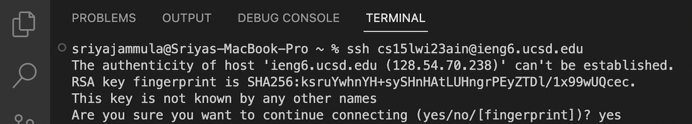

# Lab Report 1
---
## Topic : Remote Access
---

```
OVERVIEW
 The main idea of this lab report is to establish connection between your (user's) computer and the remote computer over the Internet. 
 Your computer is called the client and the remote computer is called the server. 
 Once a connection is established, you should be able to do your own work on the remote computer - any commands you run will run on the server. 
```

```
CONTENT
1. Installing VScode
2. Remotely Connecting
3. Trying Different Commands
4. Logging Out
```

>  1. Installing VScode

- The **first step** is to install a code editor on your device, I recommend VSCode or Visual Studio Code.
- To do so, go to their website and follow the commands written to download and install VSCode.
- If you are able to successfuly install it, the follow screen should be visible:


>  2. Remotely Connecting

- The next step in this lab is how to use VScode to connect to a remote computer so that you can perform tasks there
- If you're on windows : 
  - Install `git` for Windows.
- Then, open a terminal in VScode in order to use ssh.
- If this is the first time you are connecting to the server, a message like this should pop up:
 
- Type **yes** and press enter. Follow up by entering your *password*.
- Now your device is `connected` to a remote computer, and any commands you run on your device will run on that computer! 
- The following image should be the final screen you see after following all the above steps.
 
- The next image is what you should see when you login after the first time: 
 
 

>  3. Run Some Commands

- Try running some `commands` that you know of on both the computers and understand the outputs.
- Some suggested commands are cd, ls, pwd, mkdir, and cp. 
- Feel free to try your own *variations*!
- Attached below, are some examples of commands I ran.


>  4. Log Out

- Finally, to `log out` press Ctrl+D
- Then, execute the **'exit'** command.
    - Since I'm on a mac, I got logged out without having to execute the 'exit' command.    


### Thank You
