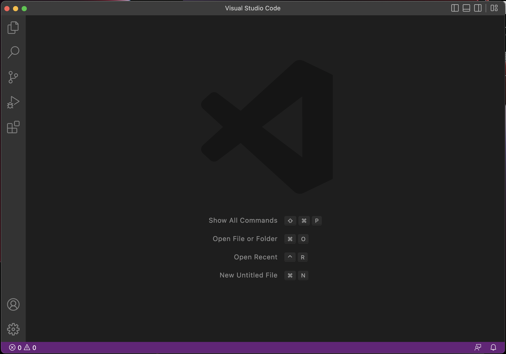
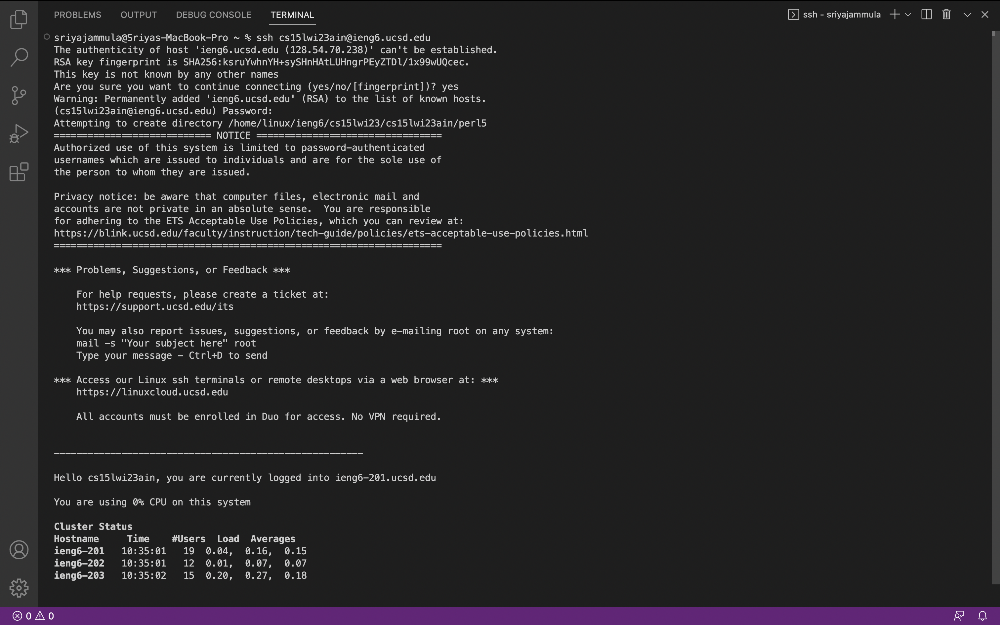
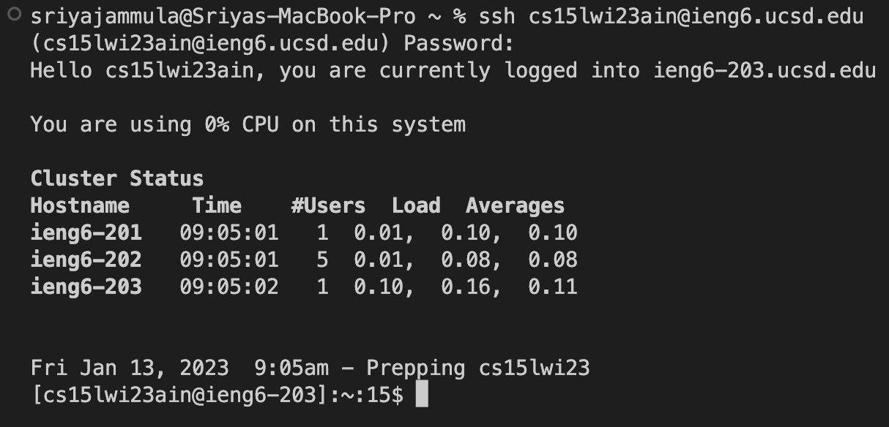
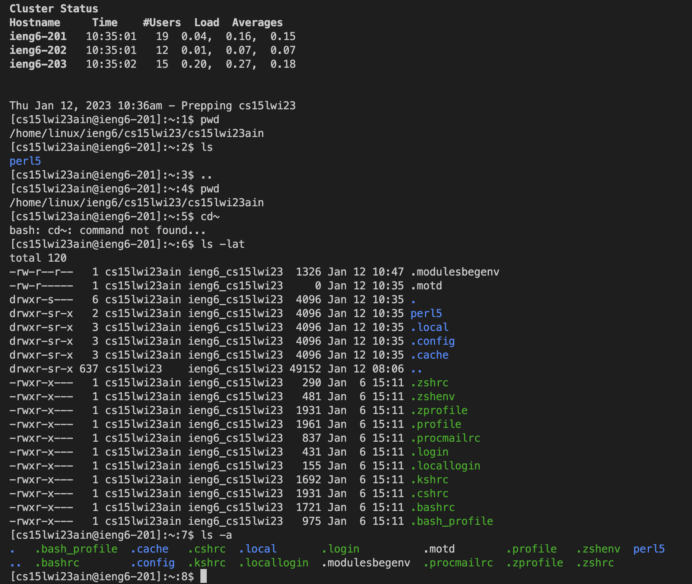
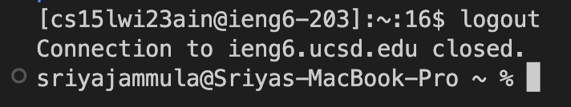

# Lab Report 1
---
## Topic : Remote Access
---
```
CONTENT
1. Installing VScode
2. Remotely Connecting
3. Trying Some Commands
```
> 1. Installing VScode

- The first step is to install a code editor called VSCode or Visual Studio Code.
- To do so, go to their website and follow the commands written to download and install VSCode.
- If you are able to successfuly install it, the follow screen should be visible:



> 2. Remotely Connecting

- The next step in this lab is how to use VScode/terminal to connect to a remote computer over the Internet to do work there
- If you're on windows : 
  - install git for Windows
  - Then, to use ssh, open a terminal in VScode
  - Since this is likely the first time you’ve connected to this server, you will probably get a message like this:
  - type yes and press enter, then give your password
  - Now your terminal is connected to a computer in the CSE basement, and any commands you run will run on that computer! 
  - We call your computer the client and the computer in the basement the server based on how you are connected
 
 - The following image is what you should see when you login after the first time: 
 
 

> 3. Run Some Commands

- Try running the commands cd, ls, pwd, mkdir, and cp a few times in different ways, both on your computer, and on the remote computer



> 4. Log Out

- Finally, to log out press Ctrl+D
- Then, execute the 'exit' command


