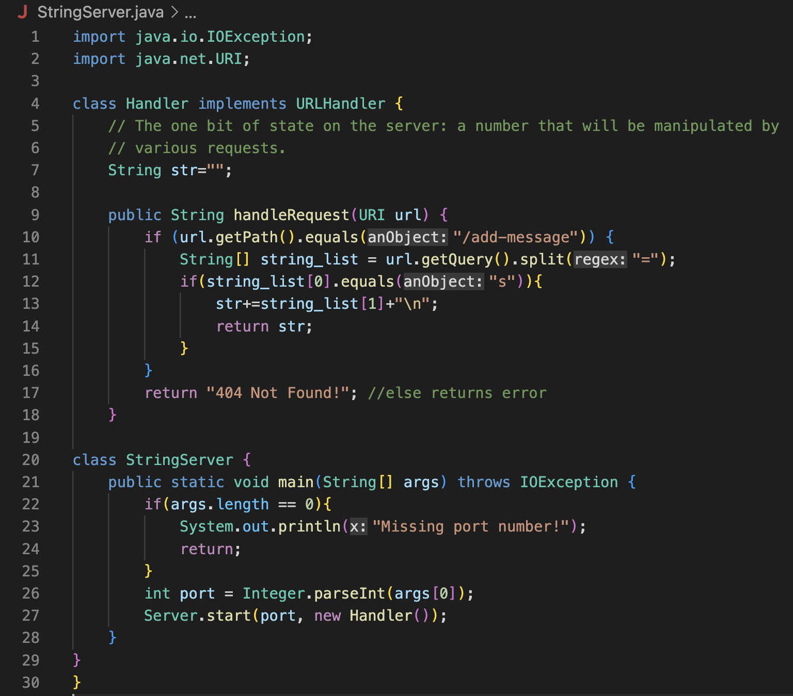
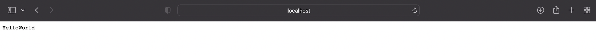
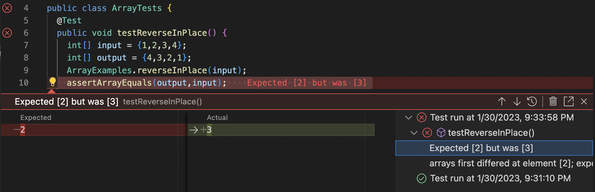

# Lab Report 2
---
## Topic : Servers and Bugs
---
### PART 1
---
**CODE**



**URL**


**USAGE of add-message**




- For both the screenshots above, the method `handleRequest` is called.
- The argument for the method is the path in the image attached above.
    - It is a URI object which passes in a string that represents the URI.
- The argument to the method `handleRequest` is the uri of the webpage
    - It is `localhost:4200/add-message?str=HelloWorld`
- The path field remains the same in both screenshots
    - It is called by `getPath()`
    - The path is `/add-message`
- The query field changes in both the screenshots
    - It is called by `getQuery()`
    - The query in the first part is `str=HelloWorld`
    - The query in the second part is `str=Sriya`
---
### PART 2
> The bug I choose for this part is in the reverseInPlace method

**JUnit test for failure inducing input**

```
@Test
public void testReverseInPlace(){
    int[] input = {1,2,3,4};
    int[] output = {4,3,2,1}
    assertArrayEquals(output, ArrayExamples.reversed(input));
```

**JUnit test that doesn't induce a failure**

```
@Test
public void testReverseInPlace(){
    int[] input = {1,1,1,1};
    int[] output = {1,1,1,1}
    ArrayExamples.reverseInPlace(input);
    assertArrayEquals(output, input);
```

**The Symptom**


**The Bug**
> Before

```
static void reverseInPlace(int[] arr) {
    for(int i = 0; i < arr.length; i += 1) {
      arr[i] = arr[arr.length - i - 1];
    }
  }
```

> After

```
static void reverseInPlace(int[] arr) {
    int[] newArray = new int[arr.length];
    for(int i = 0; i < arr.length; i += 1) {
      newArray[i] = arr[arr.length - i - 1];
    }
    for(int i=0;i<newArray.length;i++){
      arr[i]=newArray[i];
    }
  }
```
The code to fix this bug was to swap the arr with newArray, such that newArray is being updated to contain the reversed elements of arr.
Before the fix, the old array was being simultaneously fixed and iterated upon which caused the error to be seen.

### PART 3
One new thing that I learned was creating and hosting a web server in Lab 2. I found it quite interesting as we could do this through our own terminal.
Moreover, the potential to be able to change the specific *port* to any number we wish was something new!

