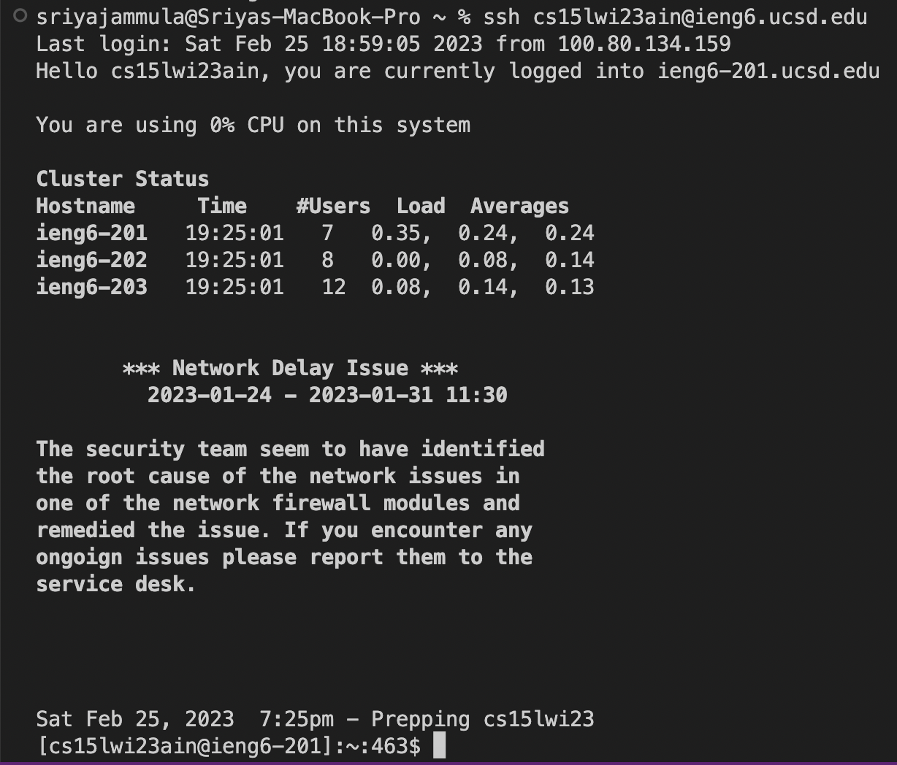
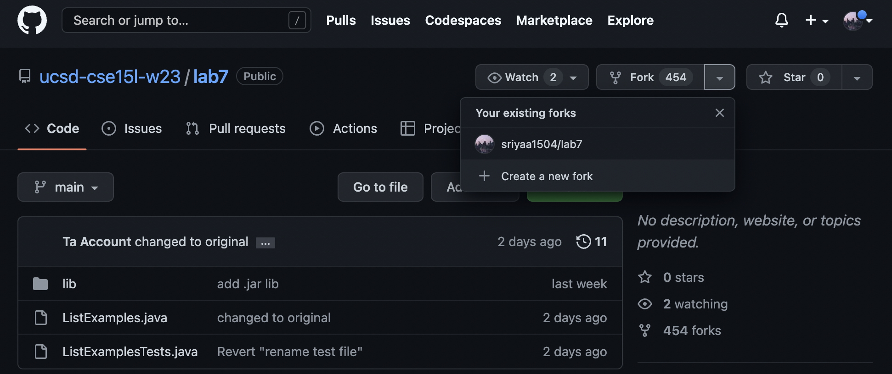
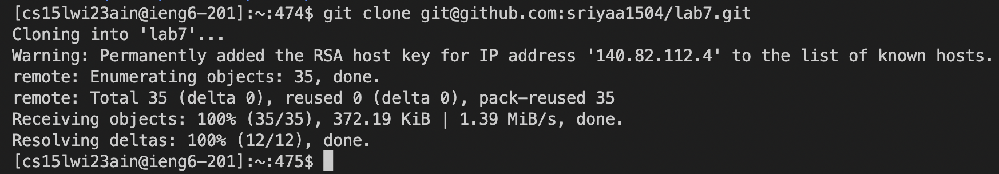
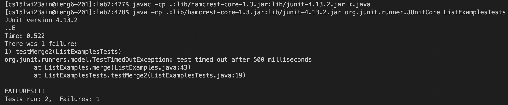

# Lab Report 4
---
## Topic : CSE Labs Done Quick
---

> STEP 1
> Logging into ieng6

`I logged into the ieng6 server by using <Command-C> to copy and <Command-V> to paste.`

> STEP 2
> Clone your fork of the repository from your Github account

`To create a fork of the repository, I went to the repository on github and clicked on the 'fork' button.
Since I already have a fork it shows it under 'existing forks'.

Then, to clone it I had to use the copy button on github and the 'git clone' command.`

> STEP 3
> Run the tests, demonstrating that they fail

`The javac -cp .:lib/hamcrest-core-1.3.jar:lib/junit-4.13.2.jar *.java command was 3 up in the search history, so I used up arrow to access it. 
Then the java -cp .:lib/hamcrest-core-1.3.jar:lib/junit-4.13.2.jar org.junit.runner.JUnitCore command was 3 up in the history, so I accessed and ran it in the same way.`

