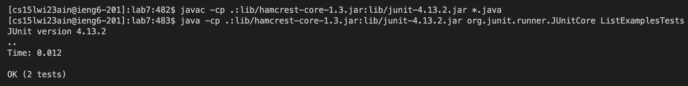
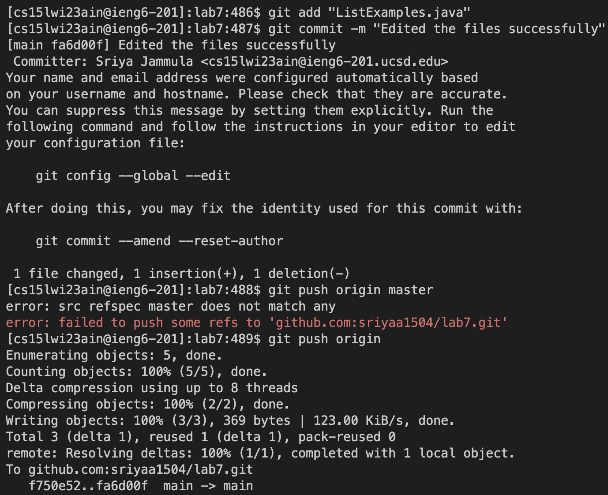

# Lab Report 4
---
## Topic : CSE Labs Done Quick
---

> STEP 1
> Logging into ieng6

`I logged into the ieng6 server by using <Command-C> to copy and <Command-V> to paste.`

> STEP 2
> Clone your fork of the repository from your Github account

`To create a fork of the repository, I went to the repository on github and clicked on the 'fork' button. Since I already have a fork it shows it under 'existing forks'.
Then, to clone it I had to use the copy button on github and the 'git clone' command.`

> STEP 3
> Run the tests, demonstrating that they fail

`The javac -cp .:lib/hamcrest-core-1.3.jar:lib/junit-4.13.2.jar *.java command was 3 up in the search history, so I used up arrow to access it. 
Then the java -cp .:lib/hamcrest-core-1.3.jar:lib/junit-4.13.2.jar org.junit.runner.JUnitCore command was 3 up in the history, so I accessed and ran it in the same way.`

> STEP 4
> Edit the code file to fix the failing test

`I used the 'nano' command to edit the file in linux. Instead of typing the entire file name I typed 'L' followed by the <tab> button for it to autofill the file name. 
I edited the file in the terminal to fix the error. Following that, I used <Ctrl-0> to save it.`

> STEP 5
> Run the tests, demonstrating that they now succeed

`Since the two commands to run a file were just used, I had to press <up><up><enter> to access them one by one.`

> STEP 6
> Commit and push the resulting change to your Github account

`I used the git add, commit, and push commands to save the changes to my Github account.`
